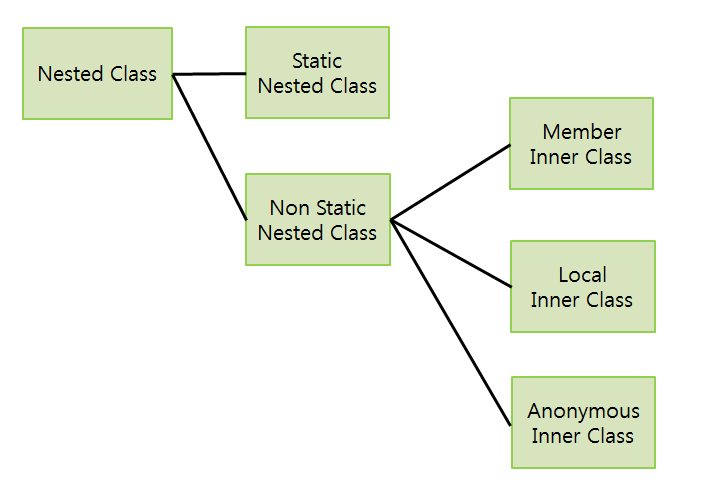

## Nested Class

---
Nested Class 


**1.구조도**




**2. Static Nested Class**

Nested 는 포함된, 중첩된이라는 뜻을 가지고 있다. Class안에 포함되어있는 Class 이것을 Nested Class라고 한다.
이 Nested Class 중 static선언이 되어있으면 Static Nested Class 라고 한다.

```Java
  1. Static Nested Class
  class Outerclass {
     static class StaticNestedClass {...}
    }
    
  2. Non Static Nested Class  
  class Outerclass {
          class NonStaticNestedClass {...}
          }
          
```

**1.** 은 Nested Class가 static으로 선언 되어있으므로 외부 클래스의 인스턴스 존재 여부와 상관없이 생성가능하다.


**외부클래스.내부클래스** 이렇게 말이다.


그렇다면 Static Nested class는 어떤 상황에서 쓰일까?


아래예제에서 확인해보자


ex) 필자가 졸업한 고등학교는 옆에 같은 이름에 중학교가 같이 붙어있었다. 이 두개의 학교를 관리하는 클래스가 각각 존재한다고 가정하자


고등학교는 HighSchool, 중학교는 MiddleSchool이다. 


각각의 클래스에서 학생을 관리하기 위한 클래스를 만들어야한다면  어떻게 만들수 있을까?


고등학교는 HighSchool_Student , 중학교는  MiddleSchool_Student 로 만들수 있지만 내부에 Student클래스를 만들 수도 있다.


```java
  public class HighSchool {
    static class Student{...}
    }
```
---

```java 
 public class University {
  static class Student {...}
  }
  
```  
이렇게 하면 HighSchool.Student , University.Student 로 각각 자신의 클래스의 Nestedclass에 접근할 수 있다.
겉으로 보기엔 유사하지만 내부적으로 다르게 구현해야할때 사용하면 좋다.
    


